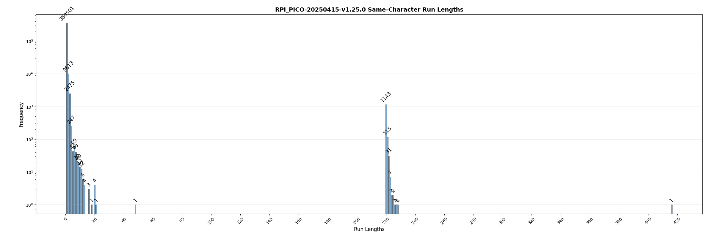
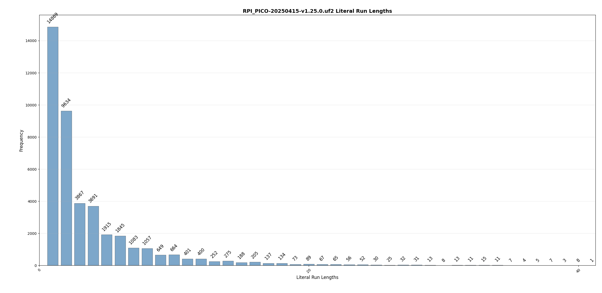

========
Research
========

.. raw:: html

   

.. role:: good
   :class: good

.. role:: bad
   :class: bad

.. role:: neutral
   :class: neutral

This page is a collection of ideas on how to improve Tamp.

Run Length Encoding
===================
.. note::
   In this document, we will focus on the typical Tamp configuration: ``window=10``, ``literal=8``.

A limitation of tamp's encoding system is that it can only handle relatively short patterns.
Under most configurations, tamp maxes out at 15 bytes.

For the typical configuration (``window=10``, ``literal=8``), a 15-byte pattern takes :math:`1 + 6 + 10 = 17` bits.
15 bytes is 120 bits, so :math:`\frac{120}{17} = 7.0588` should be the theoretical maximum compression ratio of data with Tamp.

Let's confirm this:

.. code-block:: python

   import tamp

   data = b"\xff" * 1_000_000
   compressed = tamp.compress(data)
   print(f"Ratio: {len(data) / (len(compressed) - 1)}")  # subtract 1 for the header
   # Ratio: 7.0585

If we need to encode patterns longer than 15 bytes, then we need to produce another pattern token.

How common are long repeating runs?
-----------------------------------

To get an idea of how often repeating characters are in the wild, we'll look at two examples:

* ``enwik8`` - 100MB of wikipedia data.
* ``RPI_PICO-20250415-v1.25.0.uf2`` - A popular firmware for the raspberry pi pico microcontroller.

enwik8
^^^^^^
The enwik8 dataset is used as a proxy of "human knowledge" from the `Hutter Prize <http://prize.hutter1.net/>`_ competition site.
It is used as a good balance of different types of data a typical compression algorithm might run into.

.. image:: ../../assets/enwik8-RLE-v1.10.0.png
   :alt: enwik8 RLE analysis showing run length distribution
   :align: center

A majority of the run-lengths are in the 2-50 range.

MicroPython Firmware
^^^^^^^^^^^^^^^^^^^^^
The MicroPython firmware (v1.25.0) for the raspberry pi pico (rp2040) represents a typical compiled binary that a microcontroller might run into.
For example, OTA firmware updates might be compressed to be efficiently transferred between devices.
Compiled programs are much different than the text-heavy enwik8 dataset.
It also has a lot of zero-padding which lends itself well to compression algorithms that can perform RLE or generally handle large patterns.

Due to the UF2 encoding, there are many long streams of ``0x00``. In fact, there's around 1300 occurrences of this ~220 in length. This offers a huge opportunity for RLE to significantly compress the data.

Possible encoding schemes
-------------------------
Let's imagine our initial dictionary is all ``0x00``, and we wish to encode 1,000 bytes of ``0xFF``.
How many writes do we need before we can take advantage of Tamp's full 15-bit pattern?

#. Write the ``0xFF`` literal (:math:`1 + 8 = 9` bits).
#. Write another ``0xFF`` literal (:math:`1 + 8 = 9` bits).
#. Write a 2-byte pattern match (:math:`1 + 1 + 10 = 12` bits).
#. Write a 4-byte pattern match (:math:`1 + 4 + 10 = 15` bits).
#. Write a 8-byte pattern match (:math:`1 + 6 + 10 = 17` bits).

This results in a total of 62 bits (7.75 bytes) until Tamp can be most efficient.
That means that the worst case (efficiency-wise) is attempting to encode 16 bytes.
A proposed schema needs to significantly improve this situation.

Completely Rewrite the Huffman Table
^^^^^^^^^^^^^^^^^^^^^^^^^^^^^^^^^^^^
Currently, the huffman table looks like this:

.. code-block:: python

   huffman_coding = {
       0: 0b0,
       1: 0b11,
       2: 0b1000,
       3: 0b1011,
       4: 0b10100,
       5: 0b100100,
       6: 0b100110,
       7: 0b101011,
       8: 0b1001011,
       9: 0b1010100,
       10: 0b10010100,
       11: 0b10010101,
       12: 0b10101010,
       13: 0b100111,
       "FLUSH": 0b10101011,
   }

A possibility is that we could add a huffman code that states "the following N bits indicate how many times we should repeat the last-written-character to the window buffer."

Design considerations:

* There is currently 15 symbols in the huffman table; this is nice because it fits in 4 bits.
* The number of bits of each huffman code ranges from 1 to 8 bits. This range (:math:`[0, 7]`) can be represented by 3 bits.
* The packed symbol value + bit-length is 7 bits; this allows them to neatly fit in a uint8 array.
* When compressing data, we like to use a ``uint32_t`` bit buffer because it can efficiently handle bit-shifts.
  There may be up to 7 bits of data from a previous compression cycle in the bit buffer, resulting in only 25 bits free for the current compression cycle.
  With the maximum 15-bit window, a pattern match could be :math:`1 + 8 + 15 = 24` bits.
  This leaves 1 bit left free to play around with.
* Decompressing data has the same design constraints with regards to its ``uint32_t`` input buffer.
* A fixed 8-bits indicating size seems sufficient; this would be able to represent lengths in range ``[2, 257]``. We can tweak this range by doing a similar computation that we do for ``min_pattern_size``.

All of this is to say is that we could potentially add 1 bit of data to our maximum token writing while still maintaining a lot of our existing optimizations.
This could be used to extend the huffman codes by 1 bit (9 bits total) while still maintaining a lot of our optimizations.

**Pros:**

* Compact, efficient.
* Flexible if we want to encode any other new additional compression techniques.

**Cons:**

* Requires a completely different huffman lookup for decoding, potentially bloating the decoder by an additional ~150 bytes or so.

Tweaking the Huffman Table
^^^^^^^^^^^^^^^^^^^^^^^^^^
Instead of completely rewriting the Huffman table, what if we just tweak it a little bit.
What if we remap the meaning of "12" to "do some RLE stuff"?
This would change the meaning of "13" to "12", but that can be done easily with non-branching logic:

.. code-block:: c

   if(TAMP_UNLIKELY(huffman_code == 12)){
       // This is the branching path; do RLE stuff here.
   }
   else{
       // Where use_rle is a bool
       huffman_code -= (conf->use_rle && huffman_code == 13)
   }

Here we can see that the code-cost is tiny, and it should have negligible performance impact on decoding.

**Pros:**

* Compact, efficient.
* **Very** compatible with current code base.

**Cons:**

* Reduces maximum pattern-match length from (typ.) 15 down to 14.

Use an invalid offset to represent RLE
^^^^^^^^^^^^^^^^^^^^^^^^^^^^^^^^^^^^^^
Because Tamp's window doesn't wrap, the final offset position isn't valid because a 2-byte match would overflow.
That means that we can give this offset value special meaning.

We can use the ``length`` field to represent the number of times to repeat the character.

Let's make the initial implementation "repeat the last character written to the window."
In the worst case scenario, this may introduce a 1-bit overhead that we can try to optimize out/solve later.

By the same logic of minimum-pattern-length for pattern matching, the minimum run-length in this situation would also be 2.
With this schema, we would be able to immediately ramp up to a 15-byte match.
For the previous 16-byte scenario (62 bits), we would now be able to do this in 26 bits, a significant improvement.

However, this limits us to a 15-byte RLE. We can trade off precision for greater range. We could fine tune a non-linear mapping like the following:

.. code-block:: python

   mapping = {
       0: 2,
       1: 4,
       2: 6,
       3: 8,
       4: 10,
       5: 14,  # The previous literal plus this can now have a follow-up 15-pattern match.
       6: 30,
       7: 40,
       8: 60,
       9: 80,
       10: 100,
       11: 130,
       12: 160,
       13: 200,
   }

**Pros:**

* Is a strict enhancement on the current compression protocol, meaning that there are not any real tradeoffs with the current protocol.

**Cons:**

* Inefficient use of ``window`` bits.

Literal Streaks
---------------
Incompressible data will result in frequent streaks of literals. For each literal, we lose 1 bit of storage compared to the original uncompressed data.

Let's take a look at the histograms of how many literal tokens are emitted in a row with Tamp.

.. image:: ../../assets/enwik8-literal-run-lengths.png
   :alt: enwik8 analysis showing how many "literal" tokens are emitted in a row.
   :align: center

If we had some sort of signal that says "the next X bytes are literals", we could potentially save some overhead in emitting a bunch of literals in a row. However, in our typical schema where we might assign an 8-bit huffman code to such an occurrence, we already immediately have a 9-bit overhead. If we want to be able to specify 5 bits to length, this would result in being able to represent sizes in range [15, 46].

On one end of the spectrum, 15, we only save 1 bit. On the other end of spectrum, 46, we save 32 bits (4 bytes). Consecutive literals in this length range are not that frequent, making this optimization not very attractive. Additionally, we would have to store an additional 46 bytes or so of memory to support this feature, since we would have to buffer literal output writes (and it would also make the output writes more complicated!).

Implementation
--------------
First thing's first: how determental is it to reduce the max-pattern-length from 15 to 14? This test disables the "12" huffman code and remaps "13"->"12".

+-------------------------------------+-------------+--------------------------------+------------------------+----------------+
| dataset                             | raw         | tamp (max-pattern=15)          | tamp (max-pattern=14)  | Degradation    |
+=====================================+=============+================================+========================+================+
| enwik8                              | 100,000,000 | 51,635,633 (**1.937**)         | 51,761,521 (**1.932**) | 0.244%         |
+-------------------------------------+-------------+--------------------------------+------------------------+----------------+
| build/silesia/dickens               | 10,192,446  | 5,546,761 (**1.838**)          | 5,550,021 (**1.836**)  | 0.059%         |
+-------------------------------------+-------------+--------------------------------+------------------------+----------------+
| build/silesia/mozilla               | 51,220,480  | 25,121,385 (**2.039**)         | 25,374,814 (**2.019**) | 1.009%         |
+-------------------------------------+-------------+--------------------------------+------------------------+----------------+
| build/silesia/mr                    | 9,970,564   | 5,027,032 (**1.983**)          | 5,054,346 (**1.973**)  | 0.543%         |
+-------------------------------------+-------------+--------------------------------+------------------------+----------------+
| build/silesia/nci                   | 33,553,445  | 8,643,610 (**3.882**)          | 8,857,056 (**3.788**)  | 2.469%         |
+-------------------------------------+-------------+--------------------------------+------------------------+----------------+
| build/silesia/ooffice               | 6,152,192   | 3,814,938 (**1.613**)          | 3,822,445 (**1.609**)  | 0.197%         |
+-------------------------------------+-------------+--------------------------------+------------------------+----------------+
| build/silesia/osdb                  | 10,085,684  | 8,520,835 (**1.184**)          | 8,527,578 (**1.183**)  | 0.079%         |
+-------------------------------------+-------------+--------------------------------+------------------------+----------------+
| build/silesia/reymont               | 6,627,202   | 2,847,981 (**2.327**)          | 2,852,894 (**2.323**)  | 0.173%         |
+-------------------------------------+-------------+--------------------------------+------------------------+----------------+
| build/silesia/samba                 | 21,606,400  | 9,102,594 (**2.374**)          | 9,210,905 (**2.346**)  | 1.190%         |
+-------------------------------------+-------------+--------------------------------+------------------------+----------------+
| build/silesia/sao                   | 7,251,944   | 6,137,755 (**1.182**)          | 6,137,755 (**1.182**)  | 0.000%         |
+-------------------------------------+-------------+--------------------------------+------------------------+----------------+
| build/silesia/webster               | 41,458,703  | 18,694,172 (**2.218**)         | 18,812,015 (**2.204**) | 0.630%         |
+-------------------------------------+-------------+--------------------------------+------------------------+----------------+
| build/silesia/x-ray                 | 8,474,240   | 7,510,606 (**1.128**)          | 7,510,606 (**1.128**)  | 0.000%         |
+-------------------------------------+-------------+--------------------------------+------------------------+----------------+
| build/silesia/xml                   | 5,345,280   | 1,681,687 (**3.179**)          | 1,711,843 (**3.123**)  | 1.793%         |
+-------------------------------------+-------------+--------------------------------+------------------------+----------------+
| build/RPI_PICO-20250415-v1.25.0.uf2 | 667,648     | 331,310 (**2.015**)            | 334,256 (**1.997**)    | 0.889%         |
+-------------------------------------+-------------+--------------------------------+------------------------+----------------+

Generally, the degradation is fairly small and not large enough to dissuade further research/implementation.

This experiment raises a question: what if we instead disallowed 14-byte matches, downmapping them to 13-bytes? We then keep the 15-byte max-pattern length.

+-------------------------------------+-------------+--------------------------------+------------------------+------------------------+
| dataset                             | raw         | tamp (max-pattern=15)          | tamp (max-pattern=14)  | tamp (no 14)           |
+=====================================+=============+================================+========================+========================+
| enwik8                              | 100,000,000 | 51,635,633 (**1.937**)         | 51,761,521 (**1.932**) | 51,700,012 (**1.934**) |
+-------------------------------------+-------------+--------------------------------+------------------------+------------------------+
| build/silesia/dickens               | 10,192,446  | 5,546,761 (**1.838**)          | 5,550,021 (**1.836**)  | 5,548,693 (**1.837**)  |
+-------------------------------------+-------------+--------------------------------+------------------------+------------------------+
| build/silesia/mozilla               | 51,220,480  | 25,121,385 (**2.039**)         | 25,374,814 (**2.019**) | 25,211,896 (**2.032**) |
+-------------------------------------+-------------+--------------------------------+------------------------+------------------------+
| build/silesia/mr                    | 9,970,564   | 5,027,032 (**1.983**)          | 5,054,346 (**1.973**)  | 5,027,142 (**1.983**)  |
+-------------------------------------+-------------+--------------------------------+------------------------+------------------------+
| build/silesia/nci                   | 33,553,445  | 8,643,610 (**3.882**)          | 8,857,056 (**3.788**)  | 8,660,810 (**3.874**)  |
+-------------------------------------+-------------+--------------------------------+------------------------+------------------------+
| build/silesia/ooffice               | 6,152,192   | 3,814,938 (**1.613**)          | 3,822,445 (**1.609**)  | 3,818,583 (**1.611**)  |
+-------------------------------------+-------------+--------------------------------+------------------------+------------------------+
| build/silesia/osdb                  | 10,085,684  | 8,520,835 (**1.184**)          | 8,527,578 (**1.183**)  | 8,521,635 (**1.184**)  |
+-------------------------------------+-------------+--------------------------------+------------------------+------------------------+
| build/silesia/reymont               | 6,627,202   | 2,847,981 (**2.327**)          | 2,852,894 (**2.323**)  | 2,850,157 (**2.325**)  |
+-------------------------------------+-------------+--------------------------------+------------------------+------------------------+
| build/silesia/samba                 | 21,606,400  | 9,102,594 (**2.374**)          | 9,210,905 (**2.346**)  | 9,129,316 (**2.367**)  |
+-------------------------------------+-------------+--------------------------------+------------------------+------------------------+
| build/silesia/sao                   | 7,251,944   | 6,137,755 (**1.182**)          | 6,137,755 (**1.182**)  | 6,137,762 (**1.182**)  |
+-------------------------------------+-------------+--------------------------------+------------------------+------------------------+
| build/silesia/webster               | 41,458,703  | 18,694,172 (**2.218**)         | 18,812,015 (**2.204**) | 18,726,007 (**2.214**) |
+-------------------------------------+-------------+--------------------------------+------------------------+------------------------+
| build/silesia/x-ray                 | 8,474,240   | 7,510,606 (**1.128**)          | 7,510,606 (**1.128**)  | 7,510,606 (**1.128**)  |
+-------------------------------------+-------------+--------------------------------+------------------------+------------------------+
| build/silesia/xml                   | 5,345,280   | 1,681,687 (**3.179**)          | 1,711,843 (**3.123**)  | 1,689,975 (**3.163**)  |
+-------------------------------------+-------------+--------------------------------+------------------------+------------------------+
| build/RPI_PICO-20250415-v1.25.0.uf2 | 667,648     | 331,310 (**2.015**)            | 334,256 (**1.997**)    | 331,397 (**2.015**)    |
+-------------------------------------+-------------+--------------------------------+------------------------+------------------------+

So clearly it's better to just drop the "12" symbol, downmapping it to "11".

But now this raises the general question, **is there a better nonlinear mapping?** Downmapping 12->11 is one specific little tweak, but we could be much more general about it.
We're already introducing a breaking change, we can probably get more out of it.
However, since we don't want to confound longer-pattern-matching wins with matches that could be better performed with RLE, we'll have to shelf that thought for now and implement the rest of the RLE feature.

+-------------------------------------+-------------+--------------------------------+------------------------+------------------------+---------------------+
| dataset                             | raw         | tamp (max-pattern=15)          | tamp (no 14)           | tamp (rle)             | RLE Improvement     |
+=====================================+=============+================================+========================+========================+=====================+
| enwik8                              | 100,000,000 | 51,635,633 (**1.937**)         | 51,700,012 (**1.934**) | 51,804,615 (**1.930**) | :neutral:`-0.327%`  |
+-------------------------------------+-------------+--------------------------------+------------------------+------------------------+---------------------+
| build/silesia/dickens               | 10,192,446  | 5,546,761 (**1.838**)          | 5,548,693 (**1.837**)  | 5,548,526 (**1.837**)  | :neutral:`-0.032%`  |
+-------------------------------------+-------------+--------------------------------+------------------------+------------------------+---------------------+
| build/silesia/mozilla               | 51,220,480  | 25,121,385 (**2.039**)         | 25,211,896 (**2.032**) | 24,984,172 (**2.050**) | :neutral:`+0.546%`  |
+-------------------------------------+-------------+--------------------------------+------------------------+------------------------+---------------------+
| build/silesia/mr                    | 9,970,564   | 5,027,032 (**1.983**)          | 5,027,142 (**1.983**)  | 4,683,676 (**2.129**)  | :good:`+6.830%`     |
+-------------------------------------+-------------+--------------------------------+------------------------+------------------------+---------------------+
| build/silesia/nci                   | 33,553,445  | 8,643,610 (**3.882**)          | 8,660,810 (**3.874**)  | 8,836,178 (**3.797**)  | :bad:`-2.228%`      |
+-------------------------------------+-------------+--------------------------------+------------------------+------------------------+---------------------+
| build/silesia/ooffice               | 6,152,192   | 3,814,938 (**1.613**)          | 3,818,583 (**1.611**)  | 3,819,752 (**1.611**)  | :neutral:`-0.126%`  |
+-------------------------------------+-------------+--------------------------------+------------------------+------------------------+---------------------+
| build/silesia/osdb                  | 10,085,684  | 8,520,835 (**1.184**)          | 8,521,635 (**1.184**)  | 8,503,083 (**1.186**)  | :neutral:`+0.208%`  |
+-------------------------------------+-------------+--------------------------------+------------------------+------------------------+---------------------+
| build/silesia/reymont               | 6,627,202   | 2,847,981 (**2.327**)          | 2,850,157 (**2.325**)  | 2,856,347 (**2.320**)  | :neutral:`-0.294%`  |
+-------------------------------------+-------------+--------------------------------+------------------------+------------------------+---------------------+
| build/silesia/samba                 | 21,606,400  | 9,102,594 (**2.374**)          | 9,129,316 (**2.367**)  | 8,952,213 (**2.414**)  | :good:`+1.652%`     |
+-------------------------------------+-------------+--------------------------------+------------------------+------------------------+---------------------+
| build/silesia/sao                   | 7,251,944   | 6,137,755 (**1.182**)          | 6,137,762 (**1.182**)  | 6,137,059 (**1.182**)  | :neutral:`+0.011%`  |
+-------------------------------------+-------------+--------------------------------+------------------------+------------------------+---------------------+
| build/silesia/webster               | 41,458,703  | 18,694,172 (**2.218**)         | 18,726,007 (**2.214**) | 18,726,051 (**2.214**) | :neutral:`-0.171%`  |
+-------------------------------------+-------------+--------------------------------+------------------------+------------------------+---------------------+
| build/silesia/x-ray                 | 8,474,240   | 7,510,606 (**1.128**)          | 7,510,606 (**1.128**)  | 7,513,126 (**1.128**)  | :neutral:`-0.034%`  |
+-------------------------------------+-------------+--------------------------------+------------------------+------------------------+---------------------+
| build/silesia/xml                   | 5,345,280   | 1,681,687 (**3.179**)          | 1,689,975 (**3.163**)  | 1,688,915 (**3.165**)  | :neutral:`-0.430%`  |
+-------------------------------------+-------------+--------------------------------+------------------------+------------------------+---------------------+
| build/RPI_PICO-20250415-v1.25.0.uf2 | 667,648     | 331,310 (**2.015**)            | 331,397 (**2.015**)    | 297,561 (**2.244**)    | :good:`+10.187%`    |
+-------------------------------------+-------------+--------------------------------+------------------------+------------------------+---------------------+

As expected, the RLE encoding significantly improved the ``RPI_PICO-20250415-v1.25.0.uf2`` compression.
If we weigh each of these files equally, then RLE offers a 1.128% average improvement over the base Tamp algorithm.
Any situations where it performed worse than (no 14) is more of a luck/probability distribution where a greedy-matcher sometimes performed better/worse.
