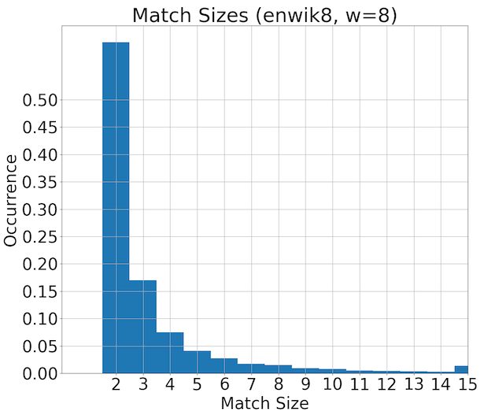

Specification
=============
Tamp uses a single-pass DEFLATE-like algorithm that is optimized for a fast,
simple implementation in micropython.
Trade-offs were made between code-complexity, speed, memory-usage, and compression-ratio.
This document describes the compression algorithm, design choices, and the data format.
Tamp outputs a continuous bit stream, where the most-significant-bit (MSb) comes first.

Stream Header
~~~~~~~~~~~~~
Tamp has a single header byte described in the following table.
The locations are zero index from the beginning of the stream.
The bit-location 0 is equivalent to typical MSb position 7 of the first byte.

+---------+-------------------+---------------------------------------------------------------------+
| Bits    | Name              | Description                                                         |
+=========+===================+=====================================================================+
| [7,6,5] | window            | Number of bits, minus 8, used to represent the size                 |
|         |                   | of the shifting window.                                             |
|         |                   | e.g. A 12-bit window is encoded as the number 4, ``0b100``.         |
|         |                   | This means the smallest window is 256 bytes, and largest is 32768.  |
+---------+-------------------+---------------------------------------------------------------------+
| [4,3]   | literal_size      | Number of bits, minus 5, in a literal.                              |
|         |                   | For example, ``0b11`` represents a standard 8 bit (1 byte) literal. |
+---------+-------------------+---------------------------------------------------------------------+
| [2]     | custom_dictionary | A custom dictionary initialization method was used                  |
|         |                   | and must be provided at decompression.                              |
+---------+-------------------+---------------------------------------------------------------------+
| [1]     | v2                | Enables Tamp v2 features. Generally improves compression, but the   |
|         |                   | decompressor needs to support it (introduced in tamp v1.11.0).      |
+---------+-------------------+---------------------------------------------------------------------+
| [0]     | more_header       | If ``True``, then the next byte in the stream is more header data.  |
|         |                   | Currently always ``False``, but allows for future expandability.    |
+---------+-------------------+---------------------------------------------------------------------+

Stream Encoding/Decoding
~~~~~~~~~~~~~~~~~~~~~~~~
After the header bytes is the data stream. The datastream is written in bits, so all data is packed
tightly with no padding.
At a high level, Tamp applies LZSS compression, followed by a fixed, pre-defined Huffman coding
for representing the match length.

LZSS
^^^^
Tamp uses a *slightly* modified LZSS compression algorithm.
Modifications are made to make the implementation simpler/faster.

1. Initialize a ring_buffer of size ``1 << window`` defined in the header. See
   _`Dictionary Initialization` for initialization details.

2. Starting at the beginning of the plaintext, find the longest match
   existing in the dictionary. If no pattern (<2 character match) is found, output a literal.
   If a pattern is detected

   a. literal: ``0b1 | literal``. The first bit (``1``) represents that the following bits
      represent a literal. The ``literal`` is ``literal_size`` bits long.

   b. token: ``0b0 | length-huffman-code | offset``. The first bit (``0``) represents that
      the following bits represent a token. The length of the pattern match is encoded via
      a pre-defined static _`Huffman code`. Finally, the ``offset`` is ``window`` bits long,
      and points at the offset from the beginning of the dictionary buffer to the pattern.
      The shortest pattern-length is either going to be 2 or 3 bytes, depending on ``window``
      and ``literal`` parameters. The shortest pattern-length encoding must be shorter than
      an equivalent stream of literals. The longest pattern-length is the minimum
      pattern-length plus 13.

Classically, the ``offset`` is from the current position in the buffer. Doing so results
in the ``offset`` distribution slightly favoring smaller numbers. Intuitively, it makes
sense that patterns are more likely to occur closer to the current text. A proposed idea
was to include the ``offset`` most-significant bit with the length-huffman-code.
Unfortuneately, the probability distribution wasn't biased enough to increase compression.
For this reason, we just encode the simple offset from the beginning of the dictionary.
This is easier to implement and has the potential to execute quicker.

Similarly, attempts to include the ``is_literal`` flag in the huffman coding did not
increase compression. An explicit ``is_literal`` flag made the code faster and simpler.

.. _dictionary-initialization:

Dictionary Initialization
^^^^^^^^^^^^^^^^^^^^^^^^^
For short messages, having a better initial dictionary can help improve compression ratios.
The amount of improvement would be dependent on the type of data being compressed.
Given that the contents of raw-binary data could be anything, we chose to focus on improving
typical english text. In order to save device space, a whole dictionary is not saved to disk.
Instead, we take 16 common characters:

.. code-block:: text

     \x000ei>to<ans\nr/.
    ^there is a "space" there.

    (or as explicit hex values)
    0X20 0X00 0X30 0X65 0X69 0X3E 0X74 0X6F 0X3C 0X61 0X6E 0X73 0X0A 0X72 0X2F 0X2E

and pseudo-randomly fill up
the dictionary with these characters. We use the XorShift32 pseudo-random number generator
due to it's good randomness characteristics, and simple implementation.

The chosen seed, 3758097560, was discovered experimentally to give typically good results.

All of this amounts to a few percent compression improvement for short messages.

.. code-block:: python

   def _xorshift32(seed):
       while True:
           seed ^= (seed << 13) & 0xFFFFFFFF
           seed ^= (seed >> 17) & 0xFFFFFFFF
           seed ^= (seed << 5) & 0xFFFFFFFF
           yield seed

   def initialize_dictionary(size):
       chars = b" \x000ei>to<ans\nr/."  # 16 most common chars in dataset

       def _gen_stream(xorshift32):
           for _ in range(size >> 3):
               value = next(xorshift32)
               yield chars[value & 0x0F]
               yield chars[value >> 4 & 0x0F]
               yield chars[value >> 8 & 0x0F]
               yield chars[value >> 12 & 0x0F]
               yield chars[value >> 16 & 0x0F]
               yield chars[value >> 20 & 0x0F]
               yield chars[value >> 24 & 0x0F]
               yield chars[value >> 28 & 0x0F]

       return bytearray(_gen_stream(_xorshift32(3758097560)))

Huffman Coding
^^^^^^^^^^^^^^
Huffman coding encodes high-probability values with less bits, and less-likely values with more bits.
In order for huffman coding to work, no encoding is allowed to be a prefix of another encoding.
If all values have equal probability, simple binary encoding is more efficient.

The following maps the pattern-size (to be added to the minimum pattern-length)
to the bits representing the huffman code.

.. code-block:: python

   huffman_coding = {
       0: 0b0,
       1: 0b11,
       2: 0b1000,
       3: 0b1011,
       4: 0b10100,
       5: 0b100100,
       6: 0b100110,
       7: 0b101011,
       8: 0b1001011,
       9: 0b1010100,
       10: 0b10010100,
       11: 0b10010101,
       12: 0b10101010,
       13: 0b100111,
       "FLUSH": 0b10101011,
   }

The match-size probabilities that generated this table were generated over the enwik8 dataset.
This huffman coding was chosen such that the longest huffman code is 8 bits long, making it easier to store and index into.
The maximum match-size is more likely than the second-highest match-size because all match-sizes greater than the maximum size get down-mapped.

For any given huffman coding schema, a equivalent coding can be obtained by inverting all the bits (reflecting the huffman tree). The single-bit, most common code ``0b0`` representing a pattern-size 2 is intentionally represented as ``0b0`` instead of ``0b1``. This makes the MSb of all other codes be 1, simplifying the decoding procedure because the number of bits read doesn't strictly have to be recorded.

Flush Symbol
------------
A special FLUSH symbol is encoded as the least likely Huffman code.
In many compression algorithms, a ``flush()`` can only be called at the end of the
compression stream, and the compressor cannot be used anymore.
In microcontroller applications, the user may want to flush the compressor buffer
while still continuing to compress more data. Examples include:

1. Flushing a chunk of logs to disk to prepare if power is removed.

2. Pushing a chunk of collected data to a remote server.

Internally, Tamp uses a 1-byte buffer to store compressed bits until a full byte is available for writing.
Invoking the ``flush`` method can have one of two results:

1. If the buffer **is** empty, no action is performed.

2. If the buffer **is not** empty, then the FLUSH Huffman code is written.
   No ``offset`` bits are written following the FLUSH code.
   The remaining buffer bits are zero-padded and flushed.

On reading, if a FLUSH is read, the reader will discard the remainder of it's 1-byte buffer.
In the best-case-scenario (write buffer is empty), a FLUSH symbol will not be emitted.
In the worst-case-scenario (1 bit in the write buffer), a FLUSH symbol (9 bits) and the remaining empty 6 bits are flushed. This adds 15 bits of overhead to the output stream.

At the very end of a stream, the FLUSH symbol is unnecessary and **may be omitted** to save an additional one or two bytes.

Miscellaneous
^^^^^^^^^^^^^
No terminating character is builtin. Tamp relies on external framing (such as from the filesystem)
to know when the data stream is complete. The final byte of a stream is zero-padded. The maximum
padding is 7 zero bits.
